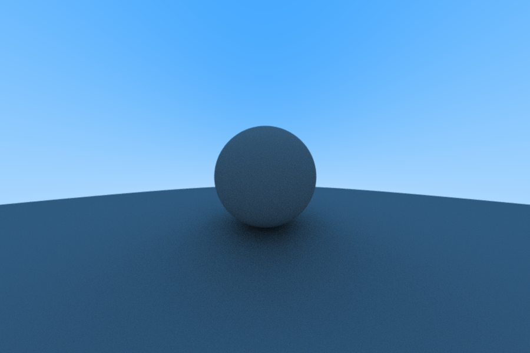

# Raytracer-Boi

This is a fun little CPU raytracing project that will render
raytraced images to a GTK window. 

It was written following the
wonderful book, "Ray Tracing in One Weekend" by Peter Shirley.

Here is the book if you are interested:
https://raytracing.github.io/books/RayTracingInOneWeekend.html

# Building
This project is dependent on `libgtk3`.

On Ubuntu, this can be installed with:

`sudo apt install libgtk-3-dev`

This code assumes additionally that `pkg-config` is installed
on your system.

Once the dependencies are installed, the project can be built
with `make` and run with `./raytracer`. A GTK Window should
pop up with the raytraced output in it.